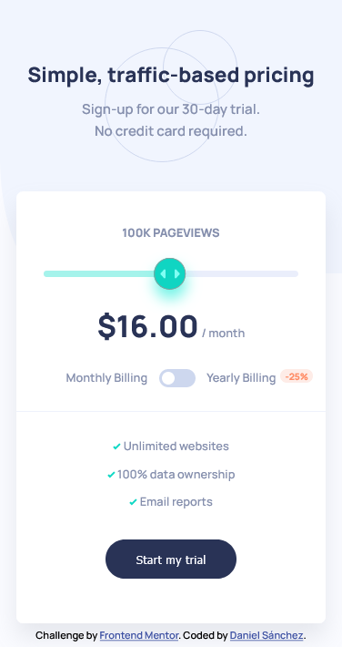
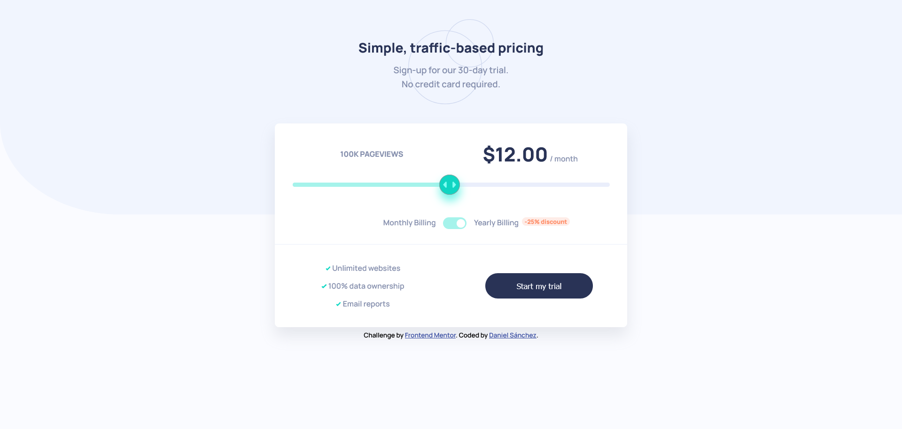

# Frontend Mentor - Interactive pricing component solution

This is a solution to the [Interactive pricing component challenge on Frontend Mentor](https://www.frontendmentor.io/challenges/interactive-pricing-component-t0m8PIyY8). Frontend Mentor challenges help you improve your coding skills by building realistic projects. 

## Table of contents

- [Overview](#overview)
  - [The challenge](#the-challenge)
  - [Screenshot](#screenshot)
  - [Links](#links)
- [My process](#my-process)
  - [Built with](#built-with)
  - [What I learned](#what-i-learned)
  - [Continued development](#continued-development)
- [Author](#author)

## Overview

### The challenge

Users should be able to:

- View the optimal layout for the app depending on their device's screen size
- See hover states for all interactive elements on the page
- Use the slider and toggle to see prices for different page view numbers

### Screenshot

### Links

- Solution URL: [Add solution URL here](https://github.com/danyrszz/FM-interactive-pricing-component)
- Live Site URL: [Add live site URL here](https://danyrszz.github.io/FM-interactive-pricing-component/)

## My process

### Built with

plain JS,CSS and HTML, mobile first, using only flexbox.

### What I learned

I tried this one approaching mobile first but using just flexbox, was quite a challenge and it took me more than expected.
I had to research to style the slider part correctly. The responsive design was more challenging than the JS part (because i didn't know flexbox quite well yet), i also struggled a little with the toggler button, wasn't that hard to program it anyway. Looking forward to more challenges! 

### Continued development

Have to make this responsive design thing click on me, also i would like to try a CSS methodology to structure more my code -and maybe reduce it- 

## Author

- [Daniel Sánchez]
- Frontend Mentor - [@yourusername](https://www.frontendmentor.io/profile/danyrszz)
- Twitter - [@yourusername](https://www.twitter.com/danyrszz)

